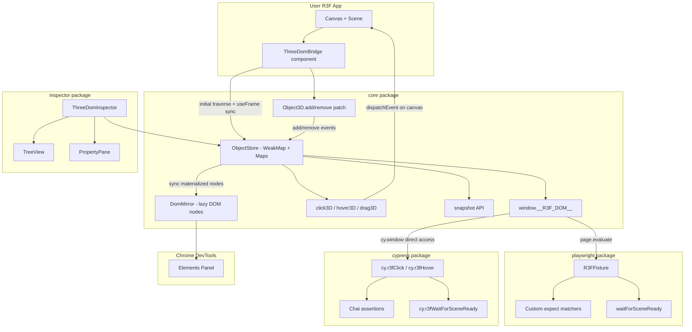
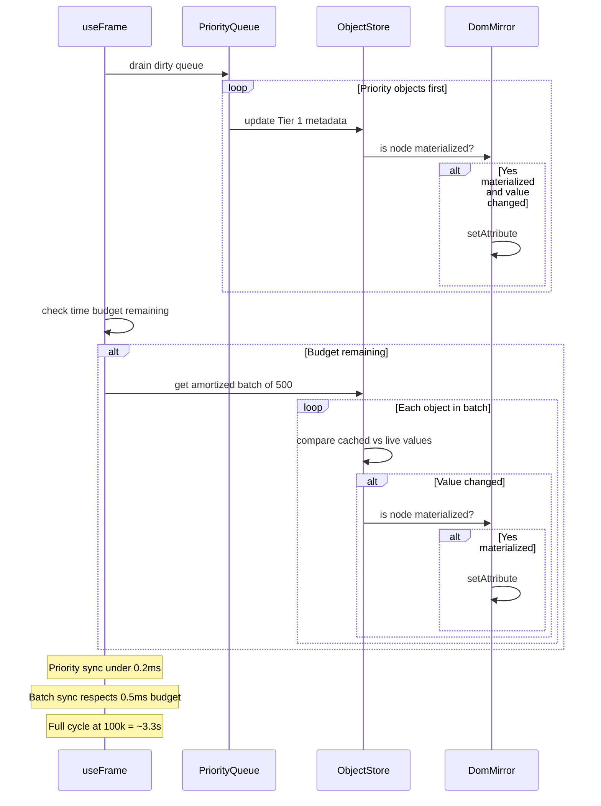
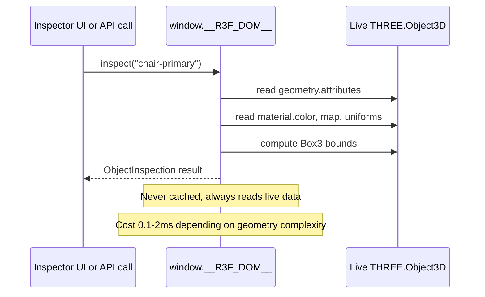

# react-three-dom — Full MVP Implementation Plan

## Monorepo Structure

```
react-three-dom/
├── pnpm-workspace.yaml
├── package.json                    # root: private, scripts, devDeps
├── tsconfig.base.json              # shared TS config
├── turbo.json                      # turborepo for build orchestration
├── .gitignore
├── README.md
├── packages/
│   ├── core/                       # @react-three-dom/core
│   │   ├── package.json
│   │   ├── tsconfig.json
│   │   ├── tsup.config.ts
│   │   └── src/
│   │       ├── index.ts            # public API barrel
│   │       ├── types.ts            # shared types
│   │       ├── store/
│   │       │   ├── ObjectStore.ts      # WeakMap-backed JS metadata store
│   │       │   └── types.ts
│   │       ├── mirror/
│   │       │   ├── CustomElements.ts   # register <three-mesh> etc.
│   │       │   ├── DomMirror.ts        # lazy DOM tree builder
│   │       │   ├── attributes.ts       # serialization helpers
│   │       │   └── sync.ts            # reconciliation logic
│   │       ├── bridge/
│   │       │   ├── ThreeDomBridge.tsx  # React component for <Canvas>
│   │       │   └── patchObject3D.ts   # Object3D.add/remove interception
│   │       ├── interactions/
│   │       │   ├── click.ts           # click3D implementation
│   │       │   ├── hover.ts           # hover3D implementation
│   │       │   ├── drag.ts            # drag3D implementation
│   │       │   ├── projection.ts      # 3D→screen coordinate projection
│   │       │   └── raycastVerify.ts   # hit verification after dispatch
│   │       ├── snapshot/
│   │       │   └── snapshot.ts        # structured JSON snapshot
│   │       └── highlight/
│   │           └── Highlighter.ts     # bbox/wireframe overlay
│   ├── inspector/                  # @react-three-dom/inspector
│   │   ├── package.json
│   │   ├── tsconfig.json
│   │   ├── tsup.config.ts
│   │   └── src/
│   │       ├── index.ts
│   │       ├── ThreeDomInspector.tsx   # main panel component
│   │       ├── TreeView.tsx            # scene graph tree
│   │       ├── SearchBar.tsx           # search by name/testId/type
│   │       ├── PropertyPane.tsx        # transform, material, etc.
│   │       └── styles.ts              # CSS-in-JS styles
│   ├── playwright/                 # @react-three-dom/playwright
│   │   ├── package.json
│   │   ├── tsconfig.json
│   │   ├── tsup.config.ts
│   │   └── src/
│   │       ├── index.ts
│   │       ├── fixtures.ts            # Playwright test.extend fixture
│   │       ├── interactions.ts        # click, hover, drag via page.evaluate
│   │       ├── assertions.ts          # custom expect matchers
│   │       └── waiters.ts             # waitForSceneReady, waitForIdle
│   └── cypress/                    # @react-three-dom/cypress
│       ├── package.json
│       ├── tsconfig.json
│       ├── tsup.config.ts
│       └── src/
│           ├── index.ts               # auto-registers commands + assertions
│           ├── index.d.ts             # TypeScript namespace declarations
│           ├── commands.ts            # cy.r3f.click(), cy.r3f.hover(), etc.
│           ├── assertions.ts          # chai-based custom assertions
│           └── waiters.ts             # cy.r3f.waitForSceneReady()
└── examples/
    └── basic/                      # example R3F app for testing
        ├── package.json
        ├── vite.config.ts
        └── src/
            ├── App.tsx
            └── main.tsx
```

---

## Phase 1 — DOM Mirror + Snapshot API

### 1.1 ObjectStore (the source of truth)

The JS store is a `WeakMap<THREE.Object3D, ObjectMetadata>` plus `Map<string, THREE.Object3D>` indexes for lookups by uuid, testId, and name. This is what all APIs read from — never the DOM. Must handle up to **100,000 objects** without degradation.

**Two-tier data model:**

- **Tier 1 (always cached):** Lightweight metadata — ~120 bytes per object, ~12 MB at 100k. Stored for every tracked object.
- **Tier 2 (on-demand):** Heavy data — geometry buffers, vertex positions, UV maps, texture refs, full material uniforms. Never stored in the ObjectStore. Accessed lazily via `inspect(uuid)` which reads directly from the live Three.js object.

```typescript
// packages/core/src/store/ObjectStore.ts

// Tier 1: always in memory for every object (~120 bytes each)
interface ObjectMetadata {
  uuid: string;
  name: string;
  type: string;              // "Mesh" | "Group" | "PointLight" | ...
  visible: boolean;
  testId?: string;           // from userData.testId
  geometryType?: string;     // "BoxGeometry", "BufferGeometry", etc.
  materialType?: string;     // "MeshStandardMaterial", etc.
  vertexCount?: number;      // count only, not buffer data
  triangleCount?: number;    // count only
  instanceCount?: number;    // for InstancedMesh
  position: [number, number, number];
  rotation: [number, number, number];
  scale: [number, number, number];
  parentUuid: string | null;
  childrenUuids: string[];
  boundsDirty: boolean;      // flag for lazy bounds recomputation
}

// Tier 2: computed on-demand, never stored
interface ObjectInspection {
  metadata: ObjectMetadata;
  worldMatrix: number[];          // 16 floats
  bounds: { min: number[]; max: number[] };
  geometry?: {
    attributes: Record<string, { itemSize: number; count: number }>;
    index?: { count: number };
    boundingSphere?: { center: number[]; radius: number };
  };
  material?: {
    type: string;
    color?: string;
    map?: string;            // texture name/uuid
    uniforms?: Record<string, unknown>;  // for ShaderMaterial
  };
  userData: Record<string, unknown>;
}
```

- `register(obj)` — add object + traverse children, populate Tier 1 only
- `unregister(obj)` — remove object + children, clean up indexes
- `update(obj)` — refresh Tier 1 cached values from live Three.js object (compare-and-set)
- `inspect(uuid)` — compute Tier 2 data on-demand from live Three.js object (not cached)
- `getByTestId(id)` — O(1) Map lookup
- `getByUuid(uuid)` — O(1) Map lookup
- `getByName(name)` — O(1) Map lookup (returns array, names aren't unique)
- `getAllObjects()` — iterator over all tracked metadata
- `getCount()` — total tracked objects

### 1.2 Custom Elements Registration

Register custom elements: `three-scene`, `three-group`, `three-mesh`, `three-light`, `three-camera`, `three-object` (fallback).

```typescript
// packages/core/src/mirror/CustomElements.ts
const TAG_MAP: Record<string, string> = {
  Scene: 'three-scene',
  Group: 'three-group',
  Mesh: 'three-mesh',
  SkinnedMesh: 'three-mesh',
  InstancedMesh: 'three-mesh',
  PointLight: 'three-light',
  DirectionalLight: 'three-light',
  SpotLight: 'three-light',
  // ... etc
  PerspectiveCamera: 'three-camera',
  OrthographicCamera: 'three-camera',
};
```

Each class extends `HTMLElement` with **interactive properties and methods** for console debugging. No shadow DOM needed. Register once via `ensureCustomElements()`.

When a user selects a node in DevTools Elements panel and uses `$0` in the console, they get full access:

```typescript
// packages/core/src/mirror/CustomElements.ts
class ThreeElement extends HTMLElement {
  // Tier 1: lightweight cached metadata (always available)
  get metadata(): ObjectMetadata { ... }

  // Tier 2: on-demand heavy inspection (reads live Three.js object)
  inspect(): ObjectInspection { ... }

  // Raw Three.js object reference (for advanced debugging)
  get object3D(): THREE.Object3D | null { ... }

  // Convenience shortcuts
  get position(): [number, number, number] { ... }
  get visible(): boolean { ... }
  get testId(): string | undefined { ... }
  get bounds(): { min: number[]; max: number[] } { ... }

  // Interaction methods
  click(): void { ... }
  hover(): void { ... }

  // Pretty console output
  toString(): string { return `<${this.tagName} name="${this.dataset.name}" testId="${this.dataset.testId}">`; }
}
```

Console usage after selecting a `<three-mesh>` in Elements panel:

```javascript
$0                    // <three-mesh data-test-id="chair-primary" ...>
$0.metadata           // { uuid, name, type, position, ... } — Tier 1, instant
$0.inspect()          // { geometry: { attributes: ... }, material: { ... } } — Tier 2, live read
$0.object3D           // THREE.Mesh { ... } — raw Three.js object
$0.object3D.material  // direct Three.js access for anything not covered by inspect()
$0.position           // [0, 1, 0]
$0.bounds             // { min: [-0.5, 0, -0.5], max: [0.5, 2, 0.5] }
$0.click()            // trigger deterministic click on this mesh
```

### 1.3 Lazy DOM Mirror

`DomMirror` manages the parallel DOM tree under a user-specified root element (e.g., `#three-dom-root`). Critical for 100k-scale:

- **JS store (ObjectStore) holds Tier 1 metadata for all objects** — ~12 MB at 100k, acceptable
- **DOM tree materializes lazily** — only create DOM nodes for what's actively visible/queried
- **Max materialized DOM nodes capped at ~2,000** — oldest/deepest nodes are evicted (LRU) when cap is reached to prevent browser slowdown
- `materialize(uuid)` — creates a DOM node with Tier 1 attributes for one object
- `materializeSubtree(uuid, depth)` — expand a subtree to N levels deep
- `dematerialize(uuid)` — remove DOM node but keep JS metadata (LRU eviction calls this)
- `querySelector(selector)` / `querySelectorAll(selector)` — searches the JS store first (fast), then materializes only the matching objects so CSS selectors work
- `setMaxNodes(n)` — configurable cap (default 2,000)

Attributes on materialized DOM nodes (Tier 1 data only):

```
data-uuid, data-name, data-type, data-visible,
data-test-id, data-geometry, data-material,
data-position, data-rotation, data-scale,
data-vertex-count, data-triangle-count, data-instance-count
```

Heavy Tier 2 data (geometry buffers, material uniforms, full bounds) is never written as DOM attributes. It's accessible three ways:

- **Console via DOM element:** Select a `<three-mesh>` in DevTools, then `$0.inspect()` / `$0.object3D` / `$0.metadata`
- **Global API:** `window.__R3F_DOM__.inspect(uuid)`
- **Inspector UI:** PropertyPane shows Tier 2 data for the selected object

### 1.4 Sync Strategy (amortized, 100k-scale)

At 100k objects, a naive full-traversal every frame is impossible (~100ms). The strategy uses three layers:

**Layer 1: Structural sync (event-driven, O(1) per change)**

- `Object3D.add`/`remove` patching fires instantly when objects are added/removed
- Zero per-frame cost for structure

**Layer 2: Property sync (amortized batches, adaptive)**

- Flat list of all tracked objects, processed in batches per frame
- Batch size adapts to maintain a **per-frame time budget** (default: 0.5ms)
- At 100k objects with 500/batch: full cycle = 200 frames = ~3.3 seconds at 60fps
- This is acceptable because most objects are static — animated objects are handled by Layer 3

**Layer 3: Priority queue for active objects**

- Objects detected as "changed" (via `matrixWorldNeedsUpdate` flag or dirty marking) are promoted to a priority queue
- Priority queue objects are synced **every frame**, ahead of the amortized batch
- In practice, <1% of objects change per frame (animations, user interaction), so this stays under budget

**DOM writes: only for materialized nodes (capped at ~2,000) where values differ**

```typescript
// packages/core/src/bridge/ThreeDomBridge.tsx
function ThreeDomBridge({ root, batchSize = 500, timeBudgetMs = 0.5 }) {
  const scene = useThree((s) => s.scene);
  const cursorRef = useRef(0);

  useEffect(() => {
    objectStore.registerTree(scene);
    domMirror.buildInitialTree(scene);
    patchObject3D(scene, objectStore, domMirror);
    exposeGlobalAPI(objectStore, domMirror, interactions);
  }, [scene]);

  useFrame(() => {
    const start = performance.now();

    // Layer 3: sync priority (changed) objects first
    const dirtyObjects = objectStore.drainDirtyQueue();
    for (const obj of dirtyObjects) {
      objectStore.update(obj);
      domMirror.syncAttributes(obj);
    }

    // Layer 2: amortized batch for remaining objects
    const objects = objectStore.getFlatList();
    const budgetRemaining = timeBudgetMs - (performance.now() - start);
    if (budgetRemaining > 0.1) {
      const end = Math.min(cursorRef.current + batchSize, objects.length);
      for (let i = cursorRef.current; i < end; i++) {
        if (performance.now() - start > timeBudgetMs) break; // respect budget
        objectStore.update(objects[i]);
        domMirror.syncAttributes(objects[i]);
      }
      cursorRef.current = end >= objects.length ? 0 : end;
    }
  });

  return null;
}
```

**Scaling characteristics:**


| Scene size | Tier 1 memory | Priority sync cost | Full cycle time | Max DOM nodes |
| ---------- | ------------- | ------------------ | --------------- | ------------- |
| 1,000      | ~120 KB       | <0.1ms/frame       | ~120ms (2s)     | 1,000 (all)   |
| 10,000     | ~1.2 MB       | <0.1ms/frame       | ~330ms (5.5s)   | 2,000         |
| 100,000    | ~12 MB        | <0.2ms/frame       | ~3.3s           | 2,000         |


### 1.5 Public Global API

```typescript
// Exposed as window.__R3F_DOM__
interface R3FDOM {
  // Tier 1: lightweight lookups (O(1), always available)
  getByTestId(id: string): ObjectMetadata | null;
  getByUuid(uuid: string): ObjectMetadata | null;
  getByName(name: string): ObjectMetadata[];
  getCount(): number;
  snapshot(): SceneSnapshot;            // full structured JSON from Tier 1 store

  // Tier 2: on-demand heavy inspection (reads live Three.js object)
  inspect(idOrUuid: string): ObjectInspection | null;

  // Interactions (Phase 2)
  click(idOrUuid: string): void;
  hover(idOrUuid: string): void;
  drag(idOrUuid: string, delta: { x: number; y: number; z: number }): void;

  // Raw access (for advanced debugging)
  getObject3D(uuid: string): THREE.Object3D | null;

  version: string;
}
```

### 1.6 Snapshot

`snapshot()` returns a structured JSON tree built from the ObjectStore (never the DOM):

```typescript
interface SceneSnapshot {
  timestamp: number;
  objectCount: number;
  tree: SnapshotNode;
}
interface SnapshotNode {
  uuid: string;
  name: string;
  type: string;
  testId?: string;
  visible: boolean;
  position: [number, number, number];
  children: SnapshotNode[];
}
```

---

## Phase 2 — Deterministic Interactions

### 2.1 3D-to-Screen Projection

```typescript
// packages/core/src/interactions/projection.ts
function projectToScreen(
  obj: THREE.Object3D,
  camera: THREE.Camera,
  canvasSize: { width: number; height: number }
): { x: number; y: number } | null
```

- Compute bounding box center in world space via `new Box3().setFromObject(obj).getCenter()`
- Project to NDC via `center.project(camera)`
- Convert to pixel coordinates
- Return `null` if behind camera or off-screen
- Fallback: try bbox corners and face centers if center fails

### 2.2 click3D / hover3D

```typescript
// packages/core/src/interactions/click.ts
function click3D(idOrUuid: string): boolean {
  const obj = resolveObject(idOrUuid);
  const { camera, gl, size } = getR3FState();
  const point = projectToScreen(obj, camera, size);
  if (!point) throw new Error(`Object "${idOrUuid}" is not visible on screen`);

  const canvas = gl.domElement;
  dispatchPointerSequence(canvas, point, 'click');

  // Verify hit via raycast
  return verifyRaycastHit(point, obj, camera, size);
}
```

`dispatchPointerSequence` fires: `pointerdown` -> `pointerup` -> `click` with correct `clientX`, `clientY`, `pointerId`, `bubbles: true`.

### 2.3 Hover dispatches `pointermove` -> `pointerover` -> `pointerenter`.

### 2.4 drag3D dispatches `pointerdown` at start -> sequence of `pointermove` along path -> `pointerup` at end.

### 2.5 Raycast Verification

After dispatching events, cast a ray from the projected screen point and verify the intended object is the first hit. If not, try alternate sample points (bbox corners). This catches occlusion edge cases and provides clear error messages: `"click3D('chair') failed: object is occluded by 'table'"`.

### 2.6 Highlight on Selection

When a DOM node is clicked in DevTools (or via the inspector), render a `THREE.BoxHelper` or wireframe outline around the corresponding Three.js object. Implemented as a React component that subscribes to the ObjectStore's selection state:

```typescript
// packages/core/src/highlight/Highlighter.ts
// Adds/removes BoxHelper children to selected objects
// Cleans up automatically when selection changes
```

---

## Phase 3 — Inspector Overlay UI

### 3.1 `ThreeDomInspector` Component

```tsx
<ThreeDomInspector hotkey="Ctrl+Shift+I" position="right" />
```

A React component rendered **outside** the Canvas (in the regular DOM). Reads from the ObjectStore, not the DOM mirror.

### 3.2 TreeView

- Virtualized tree using a lightweight virtual scroll (custom, or `react-arborist`)
- Lazy children loading from ObjectStore
- Node rendering: icon (mesh/light/camera/group) + name + testId badge
- Click to select -> highlight in scene
- Right-click context menu: "Copy testId", "Copy uuid", "Log to console"

### 3.3 SearchBar

- Filters by: name, testId, type
- Fuzzy matching on name
- Results shown inline in the tree (filtered view)

### 3.4 PropertyPane

Shows for selected object:

- Transform: position, rotation, scale (read-only in v1)
- Visibility: visible, frustumCulled
- Material: type, color, map name
- Geometry: type, vertex count, triangle count
- Bounds: world bounding box
- userData (JSON view)

### 3.5 Styles

CSS-in-JS (no external CSS dependency). Dark theme matching browser DevTools. The panel is a fixed/absolute positioned div with a configurable hotkey toggle.

---

## Phase 4 — Playwright SDK

### 4.1 Package: `@react-three-dom/playwright`

Extends Playwright's `test` with a custom `r3f` fixture:

```typescript
// packages/playwright/src/fixtures.ts
import { test as base } from '@playwright/test';

export const test = base.extend<{ r3f: R3FFixture }>({
  r3f: async ({ page }, use) => {
    // Wait for window.__R3F_DOM__ to be available
    await page.waitForFunction(() => !!window.__R3F_DOM__);
    const fixture = new R3FFixture(page);
    await use(fixture);
  },
});
```

### 4.2 R3FFixture API

```typescript
class R3FFixture {
  async click(testId: string): Promise<void>;
  async hover(testId: string): Promise<void>;
  async drag(testId: string, delta: { x: number; y: number; z: number }): Promise<void>;
  async snapshot(): Promise<SceneSnapshot>;
  async getObject(testId: string): Promise<ObjectMetadata>;
  async waitForObject(testId: string, opts?: { timeout: number }): Promise<void>;
  async waitForSceneReady(opts?: { timeout: number }): Promise<void>;
}
```

All methods use `page.evaluate()` to call `window.__R3F_DOM__` methods.

### 4.3 Custom Assertions

Extend Playwright's `expect` with 3D-native matchers:

```typescript
// packages/playwright/src/assertions.ts
expect.extend({
  async toExist(page, testId) { ... },
  async toBeVisible(page, testId) { ... },
  async toBeInFrustum(page, testId) { ... },
  async toHaveBounds(page, testId, expected) { ... },
  async toHaveInstanceCount(page, testId, count) { ... },
  async toHavePosition(page, testId, pos, tolerance?) { ... },
});
```

Usage in tests:

```typescript
import { test, expect } from '@react-three-dom/playwright';

test('chair is visible and clickable', async ({ page, r3f }) => {
  await page.goto('/');
  await r3f.waitForSceneReady();

  await expect(r3f).toExist('chair-primary');
  await expect(r3f).toBeVisible('chair-primary');
  await expect(r3f).toBeInFrustum('chair-primary');

  await r3f.click('chair-primary');
  await expect(r3f).toHavePosition('chair-primary', [0, 1, 0], 0.1);
});
```

### 4.4 Waiting / Idle Detection

`waitForSceneReady()` polls `window.__R3F_DOM__.snapshot()` and waits until:

- Object count stabilizes across 3 consecutive checks (100ms apart)
- No new objects added/removed in the last 300ms

`waitForIdle()` waits until no property changes detected for N frames (useful after animations).

---

## Phase 4b — Cypress SDK

### Key Difference from Playwright

Cypress runs **in the same browser process** as the app. This means `cy.window()` gives direct access to `window.__R3F_DOM__` — no `page.evaluate()` serialization boundary. This makes the Cypress adapter simpler and slightly faster.

### 4b.1 Package: `@react-three-dom/cypress`

Setup in `cypress/support/e2e.ts`:

```typescript
import '@react-three-dom/cypress';
// This auto-registers all commands and assertions
```

### 4b.2 Custom Commands

```typescript
// packages/cypress/src/commands.ts
Cypress.Commands.addAll({
  r3fClick(testId: string) {
    return cy.window().then((win) => {
      const r3f = (win as any).__R3F_DOM__;
      if (!r3f) throw new Error('react-three-dom not found. Is ThreeDomBridge mounted?');
      r3f.click(testId);
    });
  },
  r3fHover(testId: string) {
    return cy.window().then((win) => win.__R3F_DOM__.hover(testId));
  },
  r3fDrag(testId: string, delta: { x: number; y: number; z: number }) {
    return cy.window().then((win) => win.__R3F_DOM__.drag(testId, delta));
  },
  r3fSnapshot() {
    return cy.window().then((win) => win.__R3F_DOM__.snapshot());
  },
  r3fWaitForSceneReady(opts?: { timeout?: number }) {
    // Poll until object count stabilizes
  },
  r3fGetObject(testId: string) {
    return cy.window().then((win) => win.__R3F_DOM__.getByTestId(testId));
  },
});
```

Commands are prefixed with `r3f` (not namespaced under `cy.r3f.`) because Cypress does not natively support command namespaces in a type-safe way.

### 4b.3 Custom Chai Assertions

```typescript
// packages/cypress/src/assertions.ts
chai.use((chai, utils) => {
  chai.Assertion.addMethod('r3fVisible', function (testId: string) {
    // Access window.__R3F_DOM__ and check visibility
  });
  chai.Assertion.addMethod('r3fInFrustum', function (testId: string) { ... });
  chai.Assertion.addMethod('r3fExist', function (testId: string) { ... });
  chai.Assertion.addMethod('r3fInstanceCount', function (testId: string, count: number) { ... });
  chai.Assertion.addMethod('r3fPosition', function (testId: string, pos: number[], tolerance?: number) { ... });
});
```

### 4b.4 TypeScript Declarations

```typescript
// packages/cypress/src/index.d.ts
declare namespace Cypress {
  interface Chainable {
    r3fClick(testId: string): Chainable<void>;
    r3fHover(testId: string): Chainable<void>;
    r3fDrag(testId: string, delta: { x: number; y: number; z: number }): Chainable<void>;
    r3fSnapshot(): Chainable<SceneSnapshot>;
    r3fGetObject(testId: string): Chainable<ObjectMetadata | null>;
    r3fWaitForSceneReady(opts?: { timeout?: number }): Chainable<void>;
  }
  interface Assertion {
    r3fVisible(testId: string): Assertion;
    r3fInFrustum(testId: string): Assertion;
    r3fExist(testId: string): Assertion;
    r3fInstanceCount(testId: string, count: number): Assertion;
    r3fPosition(testId: string, pos: number[], tolerance?: number): Assertion;
  }
}
```

### 4b.5 Usage in Tests

```typescript
describe('3D Scene', () => {
  it('chair is visible and clickable', () => {
    cy.visit('/');
    cy.r3fWaitForSceneReady();

    cy.r3fGetObject('chair-primary').should('not.be.null');
    cy.r3fClick('chair-primary');
    cy.r3fSnapshot().then((snap) => {
      expect(snap.objectCount).to.be.greaterThan(0);
    });
  });
});
```

---

## Architecture Diagram




---

## Data Flow for Property Sync (100k-scale)



### On-Demand Heavy Data (Tier 2)




---

## Build and Tooling

- **Build:** tsup (ESM + CJS dual output, .d.ts generation)
- **Test:** Vitest for unit tests, Playwright + Cypress for E2E
- **Orchestration:** Turborepo for build caching and task ordering
- **Lint:** ESLint + Prettier
- **CI:** GitHub Actions (build + test + lint on PR)

### Peer Dependencies

- `@react-three-dom/core`: peers on `three` (>=0.150), `@react-three/fiber` (>=8.0), `react` (>=18)
- `@react-three-dom/inspector`: peers on `@react-three-dom/core`, `react`, `react-dom`
- `@react-three-dom/playwright`: peers on `@playwright/test` (>=1.40), `@react-three-dom/core`
- `@react-three-dom/cypress`: peers on `cypress` (>=12.0), `@react-three-dom/core`

---

## Implementation Order

The build order reflects dependency chains — each step produces working, testable output before the next begins.